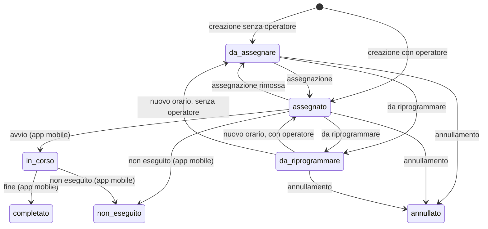

# API_CONTRACT — PeopleCare Central Operations

> **Stato del documento: contratto atteso, non esistente.**
> Descrive le API che il client desktop *si aspetta* dal sistema PeopleCare per
> sostituire i dati DEMO. Nessun endpoint qui descritto è stato verificato su un
> sistema reale e nessun indirizzo, token o credenziale è incluso nel progetto.
> È la proposta di interfaccia da concordare con chi sviluppa il backend:
> percorsi e nomi possono cambiare, purché l'implementazione HTTP dei repository
> (vedi [HANDOFF.md](HANDOFF.md)) venga adeguata di conseguenza.
>
> Tutti gli esempi JSON di questo documento coincidono con i file in
> `test/fixtures/api` e sono verificati automaticamente dai test
> (`test/data/api_contract_test.dart`): i codec del client leggono e producono
> esattamente questi payload.

## Indice

1. [Convenzioni generali](#1-convenzioni-generali)
2. [Errori](#2-errori)
3. [Mappa repository → endpoint](#3-mappa-repository--endpoint)
4. [Sessione](#4-sessione)
5. [Strutture](#5-strutture)
6. [Tipologie di servizio](#6-tipologie-di-servizio)
7. [Pazienti](#7-pazienti)
8. [Operatori](#8-operatori)
9. [Servizi](#9-servizi)
10. [Richieste di modifica](#10-richieste-di-modifica)
11. [Documenti](#11-documenti)
12. [Notifiche](#12-notifiche)
13. [Registro attività](#13-registro-attività)
14. [Report operativo](#14-report-operativo)
15. [Eventi in tempo reale](#15-eventi-in-tempo-reale)
16. [Dati prodotti dall'app mobile degli operatori](#16-dati-prodotti-dallapp-mobile-degli-operatori)
17. [Requisiti non funzionali attesi](#17-requisiti-non-funzionali-attesi)

---

## 1. Convenzioni generali

| Aspetto | Convenzione attesa |
|---|---|
| Indirizzo base | Configurato in build con `--dart-define=PEOPLECARE_API_BASE_URL=…`. Tutti i percorsi di questo documento sono relativi all'indirizzo base (es. `GET {base}/services`). La versione dell'API fa parte dell'indirizzo base (forma indicativa: `https://<host>/central-operations/v1`). |
| Formato | JSON UTF-8, chiavi in `snake_case`. |
| Codici enumerativi | In italiano e in `snake_case` (`da_assegnare`, `problema_orario`), **identici a quelli usati dall'app mobile degli operatori**. Elenco completo in [DATA_MODELS.md](DATA_MODELS.md). |
| Date e ore | RFC 3339. Il client invia sempre UTC con suffisso `Z`; in risposta accetta qualsiasi offset (`2026-09-24T09:30:00+02:00`). Le date senza ora sono `YYYY-MM-DD`. L'interfaccia mostra l'ora locale della postazione (Europe/Rome). |
| Identificativi | `id` opachi (stringhe) generati dal sistema. I codici leggibili (`code`) sono distinti e generati anch'essi dal sistema: `OP-000184` (operatore), `SRV-2026-004812` (servizio), `RM-000321` (richiesta di modifica), `STR-02` (struttura), `TS-04` (tipologia), `PZ-004512` (paziente). |
| Campi facoltativi | In risposta `null` e chiave assente sono equivalenti. Nelle richieste il client invia sempre tutte le chiavi, con `null` per i valori vuoti. |
| Modifica completa | `PUT` sostituisce **tutti** i campi modificabili: un campo `null` cancella il valore. |
| Liste | `{"items": [...]}`. |
| Liste paginate | `{"items": [...], "total": 659, "page": 1, "page_size": 50}`; pagine numerate da 1; `page_size` massimo atteso: 500 (il sistema può imporre un limite inferiore: il client si basa su `total` e legge le pagine successive, anche per le esportazioni CSV). |
| Filtri multipli | Valori separati da virgola: `status=assegnato,in_corso`. I parametri assenti non filtrano; più parametri sono in AND. |
| Concorrenza ottimistica | Ogni risorsa modificabile ha `version` (intero che aumenta a ogni modifica). Ogni modifica invia `expected_version` (nel corpo, oppure come parametro di query per le `DELETE`). Se non coincide: `409 version_conflict`. |
| Valori sconosciuti | Il client ignora chiavi JSON che non conosce. Per alcuni enumerativi usa un valore di ripiego (indicato in [DATA_MODELS.md](DATA_MODELS.md)); stati di servizio, priorità e stati di richieste/operatori sconosciuti sono invece un errore di formato. |
| Autenticazione | **Fuori dal perimetro di questo progetto.** Il client invierà `Authorization: Bearer <access token>` ottenuto da un componente di autenticazione da definire (es. OpenID Connect con PKCE verso l'identity provider aziendale). Nessun token, segreto o credenziale è presente nel codice o nella build. |
| Autorizzazione | Il sistema limita i dati alle strutture di competenza dell'utente (`facility_ids` di `GET /me`, lista vuota = tutte) e risponde `403 forbidden` alle operazioni non consentite. |
| Messaggi | I campi `message` degli errori sono in italiano e vengono mostrati all'utente così come arrivano. |
| Header consigliati | `Accept: application/json`; `X-Request-Id` (UUID generato dal client, per correlare i log); `User-Agent: PeopleCareCentralOperations/<versione> (Windows)`; `Idempotency-Key` sulle `POST` di creazione, per evitare duplicati in caso di nuovo invio dopo un timeout. |

## 2. Errori

Formato atteso del corpo di ogni risposta di errore:

<!-- esempio: error_validation.json -->
```json
{
  "error": {
    "code": "validation_error",
    "message": "Controlla i dati del servizio.",
    "field_errors": {
      "scheduled_end": "L'ora di fine deve essere successiva all'ora di inizio.",
      "address": "Indica l'indirizzo."
    }
  }
}
```

| HTTP | `error.code` | Quando | Eccezione nel client | Comportamento dell'interfaccia |
|---|---|---|---|---|
| 400 / 422 | `validation_error` (o `bad_request`) | Dati non validi; `field_errors` indica i campi | `ValidationException` | Messaggio sul campo interessato |
| 401 | `unauthenticated` | Token assente o scaduto | `UnauthenticatedException` | "Sessione scaduta" |
| 403 | `forbidden` | Operazione non permessa all'utente | `PermissionDeniedException` | Messaggio di errore |
| 404 | `not_found` | Risorsa inesistente o non visibile | `NotFoundException` | Messaggio e aggiornamento della vista |
| 409 | `version_conflict` | `expected_version` diversa dalla versione attuale | `ConcurrencyConflictException` | Invito a ricaricare e riprovare |
| 409 | `operation_not_allowed` | Operazione non ammessa nello stato attuale (es. eliminare un servizio avviato) | `OperationNotAllowedException` | Messaggio esplicativo |
| 502 / 503 / 504 | — | Sistema non raggiungibile | `ConnectivityException` | Messaggio e possibilità di riprovare |
| altri 5xx | — | Errore imprevisto | `UnexpectedRepositoryException` | Messaggio generico |

La traduzione è già implementata in `lib/src/data/dto/api_errors.dart`
(`exceptionFromApiError`). Se il corpo manca o non è leggibile decide lo status HTTP.

<!-- esempio: error_version_conflict.json -->
```json
{
  "error": {
    "code": "version_conflict",
    "message": "Il servizio è stato modificato da un altro utente. Ricarica e riprova."
  }
}
```

<!-- esempio: error_operation_not_allowed.json -->
```json
{
  "error": {
    "code": "operation_not_allowed",
    "message": "Il servizio è già stato avviato o concluso: resta nello storico."
  }
}
```

Chiavi usate in `field_errors` (coincidono con i nomi dei campi del corpo):
`service_type_id`, `custom_type_name`, `scheduled_end`, `patient`,
`facility_id`, `operator_id`, `address`, `phone`, `first_name`, `last_name`,
`email`, `qualification`, `primary_facility_id`, `secondary_facility_ids`,
`name`, `city`, `category`, `default_duration_minutes`,
`required_qualifications`, `reason`, `message`, `username`.

## 3. Mappa repository → endpoint

L'interfaccia legge e scrive solo attraverso i repository astratti di
`lib/src/domain/repositories`. Ogni metodo corrisponde a una chiamata:

| Repository · metodo | Endpoint atteso |
|---|---|
| `SessionRepository.getCurrentUser` | `GET /me` |
| `FacilityRepository.listFacilities` | `GET /facilities` |
| `FacilityRepository.getFacility` | `GET /facilities/{id}` |
| `FacilityRepository.createFacility` | `POST /facilities` |
| `FacilityRepository.updateFacility` | `PUT /facilities/{id}` |
| `ServiceTypeRepository.listServiceTypes` | `GET /service-types` |
| `ServiceTypeRepository.getServiceType` | `GET /service-types/{id}` |
| `ServiceTypeRepository.createServiceType` | `POST /service-types` |
| `ServiceTypeRepository.updateServiceType` | `PUT /service-types/{id}` |
| `PatientRepository.searchPatients` | `GET /patients` |
| `PatientRepository.getPatient` | `GET /patients/{id}` |
| `OperatorRepository.listOperators` | `GET /operators` |
| `OperatorRepository.getOperator` | `GET /operators/{id}` |
| `OperatorRepository.listQualifications` | `GET /operators/qualifications` |
| `OperatorRepository.createOperator` | `POST /operators` |
| `OperatorRepository.updateOperator` | `PUT /operators/{id}` |
| `OperatorRepository.changeStatus` | `POST /operators/{id}/status` |
| `OperatorRepository.linkAccount` | `POST /operators/{id}/account` |
| `OperatorRepository.unlinkAccount` | `DELETE /operators/{id}/account` |
| `ServiceRepository.listServicesInRange` | `GET /services/calendar` |
| `ServiceRepository.searchServices` | `GET /services` |
| `ServiceRepository.getService` | `GET /services/{id}` |
| `ServiceRepository.createService` | `POST /services` |
| `ServiceRepository.updateService` | `PUT /services/{id}` |
| `ServiceRepository.rescheduleService` | `POST /services/{id}/reschedule` |
| `ServiceRepository.reassignService` | `POST /services/{id}/reassign` |
| `ServiceRepository.cancelService` | `POST /services/{id}/cancel` |
| `ServiceRepository.markToReschedule` | `POST /services/{id}/mark-to-reschedule` |
| `ServiceRepository.deleteService` | `DELETE /services/{id}` |
| `ServiceRepository.getServiceHistory` | `GET /services/{id}/history` |
| `ChangeRequestRepository.listChangeRequests` | `GET /change-requests` |
| `ChangeRequestRepository.getChangeRequest` | `GET /change-requests/{id}` |
| `ChangeRequestRepository.reply` | `POST /change-requests/{id}/reply` |
| `ChangeRequestRepository.resolve` | `POST /change-requests/{id}/resolve` |
| `DocumentRepository.searchDocuments` | `GET /documents` |
| `DocumentRepository.uploadDocument` | `POST /documents` (multipart) |
| `DocumentRepository.downloadDocument` | `GET /documents/{id}/content` |
| `DocumentRepository.markReviewed` | `POST /documents/{id}/review` |
| `DocumentRepository.deleteDocument` | `DELETE /documents/{id}` |
| `NotificationRepository.listNotifications` | `GET /notifications` |
| `NotificationRepository.countUnread` | `GET /notifications/unread-count` |
| `NotificationRepository.markRead` | `POST /notifications/{id}/read` |
| `NotificationRepository.markAllRead` | `POST /notifications/read-all` |
| `NotificationRepository.watchNew` | `GET /events` (evento `notification`) |
| `AuditRepository.searchAudit` | `GET /audit-log` |
| `ReportRepository.getOperationalReport` | `GET /reports/operational` |
| `OperationalEventsRepository.watchEvents` | `GET /events` (evento `operational_event`) |

Codec JSON pronti all'uso: `lib/src/data/dto/entity_json.dart` (entità),
`request_bodies.dart` (corpi delle azioni), `query_params.dart` (parametri di
ricerca), `api_errors.dart` (errori), `live_stream.dart` (eventi SSE).

## 4. Sessione

### `GET /me`

Utente della Centrale collegato. `facility_ids` sono le strutture di
competenza (vuota = tutte).

<!-- esempio: me.json -->
```json
{
  "id": "usr-000017",
  "display_name": "Laura Bianchi",
  "role": "Operatrice di centrale",
  "facility_ids": []
}
```

## 5. Strutture

| Endpoint | Risposta |
|---|---|
| `GET /facilities` | `200 {"items": [Struttura…]}` ordinate per `code` |
| `GET /facilities/{id}` | `200` Struttura |
| `POST /facilities` | `201` Struttura creata (`code` assegnato dal sistema) |
| `PUT /facilities/{id}` | `200` Struttura aggiornata; corpo con `expected_version` |

<!-- esempio: facility.json -->
```json
{
  "id": "str-000002",
  "code": "STR-02",
  "name": "Centro Diurno Arcobaleno",
  "kind": "centro_diurno",
  "address": "Via Roma 45",
  "city": "Seriate",
  "phone": "+39 035 000 1202",
  "email": "arcobaleno@peoplecare.example",
  "is_active": true,
  "notes": null,
  "version": 3
}
```

Corpo di `POST`/`PUT`: `name`, `kind`, `address`, `city`, `phone`, `email`,
`is_active`, `notes` (più `expected_version` nella `PUT`). Regole attese:
nome, indirizzo e comune obbligatori; nome univoco (senza distinzione di
maiuscole e accenti); email valida se presente. Una struttura disattivata
(`is_active: false`) resta visibile nello storico ma non si può scegliere per
nuovi servizi.

## 6. Tipologie di servizio

| Endpoint | Risposta |
|---|---|
| `GET /service-types` | `200 {"items": [Tipologia…]}` ordinate per `code` |
| `GET /service-types/{id}` | `200` Tipologia |
| `POST /service-types` | `201` Tipologia creata |
| `PUT /service-types/{id}` | `200` Tipologia aggiornata; corpo con `expected_version` |

<!-- esempio: service_type.json -->
```json
{
  "id": "ts-000004",
  "code": "TS-04",
  "name": "Medicazione",
  "category": "Sanitaria",
  "default_duration_minutes": 30,
  "required_qualifications": [
    "Infermiere"
  ],
  "description": "Medicazione semplice o avanzata di lesioni cutanee.",
  "is_active": true,
  "version": 1
}
```

Corpo di `POST`/`PUT`: `name`, `category`, `default_duration_minutes`
(5–720), `required_qualifications` (lista vuota = qualsiasi qualifica),
`description`, `is_active`. Nome univoco; le qualifiche richieste devono essere
tra quelle di `GET /operators/qualifications`. Una tipologia disattivata non si
può scegliere per nuovi servizi ma resta sui servizi esistenti.

## 7. Pazienti

Anagrafica in sola lettura per la Centrale (gestita altrove in PeopleCare).

| Endpoint | Parametri | Risposta |
|---|---|---|
| `GET /patients` | `q` (nome, cognome o codice; tutte le parole devono comparire), `facility_id`, `limit` (predefinito 20) | `200 {"items": [Paziente…]}` ordinati per cognome e nome |
| `GET /patients/{id}` | — | `200` Paziente |

<!-- esempio: patient.json -->
```json
{
  "id": "pz-004512",
  "code": "PZ-004512",
  "first_name": "Rosa",
  "last_name": "Ravasio",
  "birth_date": "1938-04-17",
  "address": "Via Tasso 76",
  "city": "Bergamo",
  "phone": "+39 035 000 4512",
  "facility_id": "str-000003",
  "notes": "Citofono Ravasio R., secondo piano senza ascensore."
}
```

## 8. Operatori

Entità **distinta** da pazienti e clienti. Ogni operatore ha una struttura
principale e zero o più strutture aggiuntive (`secondary_facility_ids`): il
modello supporta già due o più strutture.

| Endpoint | Parametri / corpo | Risposta |
|---|---|---|
| `GET /operators` | `q`, `facility_id` (principale **o** aggiuntiva), `status` (lista), `qualification` | `200 {"items": [Operatore…]}` ordinati per cognome e nome |
| `GET /operators/{id}` | — | `200` Operatore |
| `GET /operators/qualifications` | — | `200 {"items": ["OSS", "Infermiere", …]}` |
| `POST /operators` | anagrafica | `201` Operatore (`code` `OP-000000` assegnato dal sistema, `status: attivo`) |
| `PUT /operators/{id}` | anagrafica + `expected_version` | `200` Operatore |
| `POST /operators/{id}/status` | `status`, `reason`, `expected_version` | `200` Operatore |
| `POST /operators/{id}/account` | `username`, `expected_version` | `200` Operatore con `account` |
| `DELETE /operators/{id}/account?expected_version=7` | — | `200` Operatore senza `account` |

<!-- esempio: operator.json -->
```json
{
  "id": "opr-000184",
  "code": "OP-000184",
  "first_name": "Anna",
  "last_name": "Mariani",
  "email": "anna.mariani@peoplecare.example",
  "phone": "+39 333 000 0184",
  "qualification": "Infermiere",
  "primary_facility_id": "str-000003",
  "secondary_facility_ids": [
    "str-000001"
  ],
  "status": "attivo",
  "status_reason": null,
  "account": {
    "account_id": "acc-009912",
    "username": "anna.mariani@peoplecare.example",
    "status": "attivo",
    "linked_at": "2026-03-02T08:15:00Z"
  },
  "last_access_at": "2026-09-24T06:52:10Z",
  "notes": null,
  "created_at": "2025-11-10T09:00:00Z",
  "updated_at": "2026-09-01T14:20:00Z",
  "version": 7
}
```

Creazione (`POST /operators`; la `PUT` ha lo stesso corpo più `expected_version`):

<!-- esempio: operator_create_request.json -->
```json
{
  "first_name": "Giulia",
  "last_name": "Ferrari",
  "email": "giulia.ferrari@peoplecare.example",
  "phone": "+39 333 000 0215",
  "qualification": "OSS",
  "primary_facility_id": "str-000001",
  "secondary_facility_ids": [
    "str-000002"
  ],
  "notes": null
}
```

Regole attese: nome, cognome, qualifica obbligatori; email valida e univoca
tra gli operatori; telefono valido (6–15 cifre); struttura principale
esistente; le strutture aggiuntive sono ripulite da duplicati e dalla
principale.

Cambio di stato. `reason` è obbligatorio per `sospeso` e `disabilitato` e
diventa `status_reason`; tornando `attivo` il motivo viene azzerato. Un
operatore sospeso o disabilitato non può ricevere nuovi servizi; se ha servizi
futuri assegnati il sistema genera una notifica `operativa` per la Centrale.

<!-- esempio: operator_status_request.json -->
```json
{
  "status": "sospeso",
  "reason": "Congedo fino al 15/10",
  "expected_version": 7
}
```

Collegamento dell'account con cui l'operatore accede all'app mobile. Il
sistema normalizza `username` in minuscolo, verifica che non sia già collegato
a un altro operatore e invia l'invito (`account.status: invitato`). **Nessuna
password transita da questo client.**

<!-- esempio: operator_account_request.json -->
```json
{
  "username": "anna.mariani@peoplecare.example",
  "expected_version": 7
}
```

## 9. Servizi

### Lettura

| Endpoint | Uso nel client |
|---|---|
| `GET /services/calendar?from=&to=&facility_id=` | Calendario e dashboard: **tutti** i servizi il cui orario programmato interseca `[from, to)`, ordinati per `scheduled_start`, senza paginazione. Intervallo massimo 31 giorni (oltre: `422 validation_error`). |
| `GET /services` | Gestione servizi: ricerca paginata con filtri e ordinamento. |
| `GET /services/{id}` | Dettaglio. |
| `GET /services/{id}/history` | Cronologia delle modifiche: `{"items": [VoceRegistro…]}` dalla più recente (formato in [§13](#13-registro-attività)). |

Parametri di `GET /services`:

| Parametro | Significato |
|---|---|
| `from`, `to` | Servizi il cui orario programmato interseca l'intervallo |
| `facility_id` | Una o più strutture |
| `operator_id` | Servizi dell'operatore |
| `unassigned=true` | Solo servizi senza operatore |
| `patient_id` | Paziente registrato |
| `patient` | Testo sul nome del paziente (registrato o inserito a mano) |
| `service_type_id` | Tipologia del catalogo |
| `custom_type=true` | Solo servizi personalizzati (fuori catalogo) |
| `status`, `priority` | Uno o più codici |
| `q` | Ricerca libera su codice, paziente, tipologia, indirizzo, note, operatore |
| `sort` | `scheduled_start` (predefinito), `code`, `patient`, `status`, `priority` (dalla più urgente), `facility` |
| `order` | `asc` / `desc`; a parità di ordinamento vale `scheduled_start` crescente |
| `page`, `page_size` | Paginazione |

Servizio da catalogo, con paziente registrato, avviato dall'app mobile:

<!-- esempio: service.json -->
```json
{
  "id": "srv-004812",
  "code": "SRV-2026-004812",
  "service_type": {
    "id": "ts-000004",
    "name": "Medicazione"
  },
  "custom_type_name": null,
  "facility_id": "str-000003",
  "operator_id": "opr-000184",
  "patient": {
    "id": "pz-004512",
    "first_name": "Rosa",
    "last_name": "Ravasio"
  },
  "scheduled_start": "2026-09-24T07:30:00Z",
  "scheduled_end": "2026-09-24T08:00:00Z",
  "actual_start": "2026-09-24T07:34:00Z",
  "actual_end": null,
  "status": "in_corso",
  "priority": "alta",
  "address": "Via Tasso 76, Bergamo",
  "phone": "+39 035 000 4512",
  "directions": "Citofono Ravasio R., secondo piano senza ascensore.",
  "notes": "Controllare la medicazione al tallone sinistro.",
  "status_reason": null,
  "document_count": 1,
  "open_change_request_count": 0,
  "created_at": "2026-09-20T10:12:00Z",
  "created_by": "Laura Bianchi",
  "updated_at": "2026-09-24T07:34:00Z",
  "updated_by": "Anna Mariani",
  "version": 4
}
```

Servizio personalizzato (fuori catalogo), con paziente inserito a mano e
ancora da assegnare:

<!-- esempio: service_custom.json -->
```json
{
  "id": "srv-004907",
  "code": "SRV-2026-004907",
  "service_type": null,
  "custom_type_name": "Consegna ausili e verifica domicilio",
  "facility_id": "str-000001",
  "operator_id": null,
  "patient": {
    "id": null,
    "first_name": "Giovanni",
    "last_name": "Cortinovis"
  },
  "scheduled_start": "2026-09-26T12:00:00Z",
  "scheduled_end": "2026-09-26T13:00:00Z",
  "actual_start": null,
  "actual_end": null,
  "status": "da_assegnare",
  "priority": "normale",
  "address": "Via Borgo Palazzo 74, Seriate",
  "phone": null,
  "directions": null,
  "notes": null,
  "status_reason": null,
  "document_count": 0,
  "open_change_request_count": 0,
  "created_at": "2026-09-24T08:05:00Z",
  "created_by": "Laura Bianchi",
  "updated_at": "2026-09-24T08:05:00Z",
  "updated_by": "Laura Bianchi",
  "version": 1
}
```

Pagina di risultati di `GET /services`:

<!-- esempio: services_page.json -->
```json
{
  "items": [
    {
      "id": "srv-004907",
      "code": "SRV-2026-004907",
      "service_type": null,
      "custom_type_name": "Consegna ausili e verifica domicilio",
      "facility_id": "str-000001",
      "operator_id": null,
      "patient": {
        "id": null,
        "first_name": "Giovanni",
        "last_name": "Cortinovis"
      },
      "scheduled_start": "2026-09-26T12:00:00Z",
      "scheduled_end": "2026-09-26T13:00:00Z",
      "actual_start": null,
      "actual_end": null,
      "status": "da_assegnare",
      "priority": "normale",
      "address": "Via Borgo Palazzo 74, Seriate",
      "phone": null,
      "directions": null,
      "notes": null,
      "status_reason": null,
      "document_count": 0,
      "open_change_request_count": 0,
      "created_at": "2026-09-24T08:05:00Z",
      "created_by": "Laura Bianchi",
      "updated_at": "2026-09-24T08:05:00Z",
      "updated_by": "Laura Bianchi",
      "version": 1
    }
  ],
  "total": 1,
  "page": 1,
  "page_size": 50
}
```

Campi calcolati dal sistema: `code`, `status`, `actual_start`, `actual_end`,
`status_reason`, `document_count`, `open_change_request_count`, `created_*`,
`updated_*`, `version`. `service_type.name` e i nomi del paziente sono una
copia di sola lettura dei dati anagrafici.

### Creazione e modifica

`POST /services` → `201` Servizio. Stato iniziale: `assegnato` se è indicato
`operator_id`, altrimenti `da_assegnare`.

<!-- esempio: service_create_request.json -->
```json
{
  "service_type_id": "ts-000004",
  "custom_type_name": null,
  "scheduled_start": "2026-09-25T09:00:00Z",
  "scheduled_end": "2026-09-25T09:30:00Z",
  "patient_id": "pz-004512",
  "manual_patient": null,
  "facility_id": "str-000003",
  "operator_id": "opr-000184",
  "priority": "alta",
  "address": "Via Tasso 76, Bergamo",
  "phone": "+39 035 000 4512",
  "directions": "Citofono Ravasio R., secondo piano senza ascensore.",
  "notes": "Controllare la medicazione al tallone sinistro."
}
```

Servizio personalizzato con paziente non registrato: `service_type_id: null`
più `custom_type_name`, `patient_id: null` più `manual_patient`.

<!-- esempio: service_create_custom_request.json -->
```json
{
  "service_type_id": null,
  "custom_type_name": "Consegna ausili e verifica domicilio",
  "scheduled_start": "2026-09-26T12:00:00Z",
  "scheduled_end": "2026-09-26T13:00:00Z",
  "patient_id": null,
  "manual_patient": {
    "first_name": "Giovanni",
    "last_name": "Cortinovis"
  },
  "facility_id": "str-000001",
  "operator_id": null,
  "priority": "normale",
  "address": "Via Borgo Palazzo 74, Seriate",
  "phone": null,
  "directions": null,
  "notes": null
}
```

`PUT /services/{id}` → `200` Servizio: stesso corpo più `expected_version`.

<!-- esempio: service_update_request.json -->
```json
{
  "service_type_id": "ts-000004",
  "custom_type_name": null,
  "scheduled_start": "2026-09-25T09:00:00Z",
  "scheduled_end": "2026-09-25T09:30:00Z",
  "patient_id": "pz-004512",
  "manual_patient": null,
  "facility_id": "str-000003",
  "operator_id": "opr-000184",
  "priority": "alta",
  "address": "Via Tasso 76, Bergamo",
  "phone": "+39 035 000 4512",
  "directions": "Citofono Ravasio R., secondo piano senza ascensore.",
  "notes": "Controllare la medicazione al tallone sinistro.",
  "expected_version": 4
}
```

Regole di validazione attese (`422`, chiave in `field_errors`):

| Campo | Regola |
|---|---|
| `service_type_id` | Esistente; attiva, salvo che il servizio la usi già |
| `custom_type_name` | Obbligatorio per i servizi personalizzati |
| `scheduled_end` | Successiva a `scheduled_start`; durata massima 12 ore |
| `patient` | Paziente esistente, oppure nome e cognome per i dati manuali |
| `facility_id` | Esistente; attiva, salvo che il servizio la usi già |
| `operator_id` | Esistente; `attivo`, salvo che il servizio sia già suo |
| `address` | Obbligatorio |
| `phone` | Formato valido se presente |

Le **sovrapposizioni** di orario per lo stesso operatore **non** devono essere
rifiutate: il client le segnala in modo evidente e la decisione resta alla
Centrale.

Gli allegati si caricano dopo la creazione con `POST /documents`
(proprietario `servizio`).

### Azioni

| Endpoint | Corpo | Stati di partenza ammessi | Risultato |
|---|---|---|---|
| `POST /services/{id}/reschedule` | `scheduled_start`, `scheduled_end`, `reason?`, `expected_version` | `da_assegnare`, `assegnato`, `da_riprogrammare` | `assegnato` se c'è un operatore, altrimenti `da_assegnare`; `status_reason` azzerato |
| `POST /services/{id}/reassign` | `operator_id` (`null` = togli l'assegnazione), `reason?`, `expected_version` | `da_assegnare`, `assegnato`, `da_riprogrammare` | `assegnato` / `da_assegnare`; un servizio `da_riprogrammare` resta tale finché non riceve un nuovo orario |
| `POST /services/{id}/cancel` | `reason` (obbligatorio), `expected_version` | `da_assegnare`, `assegnato`, `da_riprogrammare` | `annullato`, `status_reason` = motivo |
| `POST /services/{id}/mark-to-reschedule` | `reason` (obbligatorio), `expected_version` | `da_assegnare`, `assegnato` | `da_riprogrammare`, `status_reason` = motivo |
| `DELETE /services/{id}?expected_version=3` | — | Mai avviato, `da_assegnare` o `annullato`, senza documenti né richieste di modifica aperte | `204`; resta la voce `servizio.eliminato` nel registro |

Fuori dagli stati ammessi: `409 operation_not_allowed` con un messaggio che
spiega il motivo. Riassegnare a un operatore non attivo: `409
operation_not_allowed`. Ogni azione restituisce il Servizio aggiornato (tranne
`DELETE`), registra una voce nel registro attività con i campi cambiati e
pubblica un evento `servizi` (§15).

<!-- esempio: service_reschedule_request.json -->
```json
{
  "scheduled_start": "2026-09-25T09:00:00Z",
  "scheduled_end": "2026-09-25T09:30:00Z",
  "reason": "Richiesta di modifica RM-000321",
  "expected_version": 4
}
```

<!-- esempio: service_reassign_request.json -->
```json
{
  "operator_id": "opr-000207",
  "reason": "Operatrice indisponibile nel pomeriggio",
  "expected_version": 5
}
```

Stesso corpo per `cancel` e `mark-to-reschedule`:

<!-- esempio: service_cancel_request.json -->
```json
{
  "reason": "Ricovero ospedaliero del paziente",
  "expected_version": 5
}
```

### Ciclo di vita



`completato`, `annullato` e `non_eseguito` sono stati finali: orario e
operatore non cambiano più (i documenti si possono sempre allegare).

L'operatore **non accetta e non rifiuta** i servizi: se c'è un problema invia
una richiesta di modifica (§10) e la Centrale decide.

## 10. Richieste di modifica

L'operatore segnala dall'app mobile un problema su un servizio assegnato
(motivo tra `problema_orario`, `sovrapposizione`, `indisponibilita`,
`problema_logistico`, `imprevisto`, `altro`, più testo libero ed
eventualmente un orario alternativo). La Centrale risponde, oppure chiude la
richiesta modificando l'orario, riassegnando o mantenendo l'assegnazione.

| Endpoint | Parametri / corpo | Risposta |
|---|---|---|
| `GET /change-requests` | `status`, `reason` (liste), `facility_id`, `operator_id`, `service_id`, `q` | `200 {"items": [Richiesta…]}` dalla più recente |
| `GET /change-requests/{id}` | — | `200` Richiesta |
| `POST /change-requests/{id}/reply` | `message`, `expected_version` | `200` Richiesta: messaggio aggiunto, stato `in_lavorazione` |
| `POST /change-requests/{id}/resolve` | decisione (sotto) | `200` Richiesta chiusa |

<!-- esempio: change_request.json -->
```json
{
  "id": "rm-000321",
  "code": "RM-000321",
  "service_id": "srv-004812",
  "service_code": "SRV-2026-004812",
  "operator_id": "opr-000184",
  "operator_name": "Anna Mariani",
  "reason": "problema_orario",
  "message": "La paziente ha una visita alle 8:30 e mi chiede di passare più tardi.",
  "proposed_start": "2026-09-25T09:00:00Z",
  "proposed_end": "2026-09-25T09:30:00Z",
  "status": "in_lavorazione",
  "created_at": "2026-09-24T06:40:00Z",
  "updated_at": "2026-09-24T07:02:00Z",
  "messages": [
    {
      "id": "msg-000877",
      "author_kind": "centrale",
      "author_name": "Laura Bianchi",
      "text": "Verifico con la famiglia e ti aggiorno entro le 10.",
      "sent_at": "2026-09-24T07:02:00Z"
    }
  ],
  "outcome": null,
  "closed_at": null,
  "closed_by": null,
  "version": 2
}
```

<!-- esempio: change_request_reply_request.json -->
```json
{
  "message": "Verifico con la famiglia e ti aggiorno entro le 10.",
  "expected_version": 1
}
```

Chiusura con nuovo orario (`orario_modificato`): il sistema applica
`scheduled_start`/`scheduled_end` al servizio con le stesse regole di
`POST /services/{id}/reschedule`.

<!-- esempio: change_request_resolve_request.json -->
```json
{
  "expected_version": 2,
  "outcome": "orario_modificato",
  "scheduled_start": "2026-09-25T09:00:00Z",
  "scheduled_end": "2026-09-25T09:30:00Z",
  "message": "Spostato alle 11:00 come richiesto."
}
```

Chiusura con riassegnazione (`riassegnato`), stesse regole di
`POST /services/{id}/reassign`:

<!-- esempio: change_request_resolve_reassign_request.json -->
```json
{
  "expected_version": 2,
  "outcome": "riassegnato",
  "operator_id": "opr-000207",
  "message": null
}
```

Chiusura senza modifiche (`assegnazione_mantenuta`):

<!-- esempio: change_request_resolve_keep_request.json -->
```json
{
  "expected_version": 2,
  "outcome": "assegnazione_mantenuta",
  "message": "L'orario resta confermato: la visita è stata spostata."
}
```

Regole attese:

- la decisione e la modifica del servizio sono **atomiche**: se la modifica
  del servizio non è ammessa (es. servizio già avviato) la richiesta resta
  aperta e la risposta è l'errore della modifica;
- `expected_version` si riferisce alla richiesta; il sistema usa la versione
  corrente del servizio;
- `message` facoltativo: se presente viene aggiunto ai messaggi e inoltrato
  all'operatore;
- alla chiusura: `status: chiusa`, `outcome`, `closed_at`, `closed_by`;
  `open_change_request_count` del servizio si aggiorna;
- una richiesta chiusa non accetta risposte né decisioni (`409
  operation_not_allowed`).

## 11. Documenti

Documenti associati a un **servizio**, un **operatore**, un **paziente** o
alla **Centrale** (procedure, circolari: `owner.id` assente).

| Endpoint | Parametri / corpo | Risposta |
|---|---|---|
| `GET /documents` | `owner_type`, `owner_id`, `category` (lista), `source`, `pending_review=true`, `q`, `from`/`to` (data di caricamento), `page`, `page_size` | `200` pagina di Documenti dal più recente |
| `POST /documents` | `multipart/form-data` (sotto) | `201` Documento (`source: centrale`) |
| `GET /documents/{id}/content` | — | `200` contenuto binario con `Content-Type` e `Content-Disposition: attachment; filename*=UTF-8''<nome>` |
| `POST /documents/{id}/review` | — | `200` Documento verificato (idempotente) |
| `DELETE /documents/{id}` | — | `204` |

<!-- esempio: document.json -->
```json
{
  "id": "doc-002231",
  "title": "Foglio firma presenza",
  "file_name": "foglio_firma_SRV-2026-004812.jpg",
  "mime_type": "image/jpeg",
  "size_bytes": 482133,
  "category": "foglio_firma",
  "owner": {
    "type": "servizio",
    "id": "srv-004812",
    "label": "SRV-2026-004812 - Rosa Ravasio"
  },
  "source": "operatore",
  "uploaded_by": "Anna Mariani",
  "uploaded_at": "2026-09-24T08:02:00Z",
  "description": null,
  "requires_review": true,
  "reviewed_at": null,
  "reviewed_by": null
}
```

Caricamento (`POST /documents`, `multipart/form-data`):

| Parte | Obbligatoria | Contenuto |
|---|---|---|
| `file` | sì | Il file, con nome e `Content-Type` |
| `owner_type` | sì | `servizio`, `operatore`, `paziente`, `centrale` |
| `owner_id` | tranne `centrale` | ID del proprietario |
| `title` | sì | Titolo (se vuoto il sistema usa il nome del file) |
| `category` | sì | Codice categoria |
| `description` | no | Testo libero |

Regole attese: file non vuoto, massimo 20 MB; proprietario esistente
(`404` altrimenti). I documenti inviati dall'app mobile hanno
`source: operatore` e `requires_review: true` finché la Centrale non li
verifica. Solo i documenti caricati dalla Centrale si possono eliminare
(altrimenti `409 operation_not_allowed`). Caricamenti ed eliminazioni su un
servizio aggiornano `document_count` del servizio.

## 12. Notifiche

Notifiche per l'utente della Centrale (lo stato di lettura è per utente).

| Endpoint | Parametri | Risposta |
|---|---|---|
| `GET /notifications` | `unread=true`, `type` (lista), `limit` (predefinito 200) | `200 {"items": [Notifica…]}` dalla più recente |
| `GET /notifications/unread-count` | — | `200 {"count": 17}` |
| `POST /notifications/{id}/read` | — | `204` (idempotente) |
| `POST /notifications/read-all` | — | `204` |

<!-- esempio: notification.json -->
```json
{
  "id": "ntf-018842",
  "type": "richiesta_modifica",
  "severity": "attenzione",
  "title": "Nuova richiesta di modifica",
  "message": "Anna Mariani - problema di orario su SRV-2026-004812 (25/09/2026 10:30).",
  "created_at": "2026-09-24T06:40:05Z",
  "read_at": null,
  "service_id": "srv-004812",
  "operator_id": "opr-000184",
  "change_request_id": "rm-000321",
  "document_id": null
}
```

Tipi attesi e quando il sistema li genera:

| `type` | Evento | `severity` tipica |
|---|---|---|
| `richiesta_modifica` | Nuova richiesta di modifica da un operatore | `attenzione` se il servizio è entro 24 ore, altrimenti `info` |
| `servizio_iniziato` | Avvio dall'app mobile | `info` |
| `servizio_terminato` | Fine dall'app mobile | `info` |
| `documento_ricevuto` | Documento inviato dall'app mobile | `info` |
| `servizio_problematico` | Servizio non eseguito, avvio mancato oltre la tolleranza | `attenzione` / `critica` (oltre 30 minuti) |
| `operativa` | Altre comunicazioni (es. operatore sospeso con servizi futuri) | variabile |

I collegamenti `service_id`, `operator_id`, `change_request_id`,
`document_id` permettono al client di aprire l'elemento interessato.

## 13. Registro attività

`GET /audit-log` con `from`, `to`, `actor_kind` (lista), `entity_type`
(lista), `entity_id`, `service_id`, `q`, `page`, `page_size` → pagina di voci
dalla più recente. Le voci sono prodotte dal sistema per ogni operazione della
Centrale, dell'app mobile e del sistema stesso; il client non le scrive mai.

<!-- esempio: audit_entry.json -->
```json
{
  "id": "aud-120455",
  "occurred_at": "2026-09-24T07:10:00Z",
  "actor": {
    "kind": "centrale",
    "name": "Laura Bianchi",
    "id": "usr-000017"
  },
  "action": "servizio.riprogrammato",
  "entity": {
    "type": "servizio",
    "id": "srv-004812",
    "label": "SRV-2026-004812"
  },
  "summary": "Riprogrammato dal 25/09/2026 10:30 al 25/09/2026 11:00 - motivo: Richiesta di modifica RM-000321.",
  "changes": [
    {
      "field": "scheduled_start",
      "label": "Inizio programmato",
      "old_value": "25/09/2026 10:30",
      "new_value": "25/09/2026 11:00"
    },
    {
      "field": "scheduled_end",
      "label": "Fine programmata",
      "old_value": "25/09/2026 11:00",
      "new_value": "25/09/2026 11:30"
    }
  ],
  "service_id": "srv-004812"
}
```

`changes` elenca i campi modificati con valori già leggibili (date in formato
italiano, nomi al posto degli ID). Codici `action` attesi:

| Area | Codici |
|---|---|
| Servizi | `servizio.creato`, `servizio.modificato`, `servizio.riprogrammato`, `servizio.riassegnato`, `servizio.annullato`, `servizio.eliminato`, `servizio.da_riprogrammare`, `servizio.iniziato`, `servizio.completato`, `servizio.non_eseguito` |
| Documenti | `documento.caricato`, `documento.ricevuto`, `documento.verificato`, `documento.eliminato` |
| Richieste di modifica | `richiesta.ricevuta`, `richiesta.risposta`, `richiesta.chiusa` |
| Operatori | `operatore.creato`, `operatore.modificato`, `operatore.stato_modificato`, `operatore.account_collegato`, `operatore.account_scollegato` |
| Strutture e tipologie | `struttura.creata`, `struttura.modificata`, `tipologia.creata`, `tipologia.modificata` |

Il sistema può introdurre altri codici: il client mostra il codice così com'è.

## 14. Report operativo

`GET /reports/operational?from=&to=&facility_id=` → Report del periodo.

<!-- esempio: operational_report.json -->
```json
{
  "period": {
    "from": "2026-09-20T22:00:00Z",
    "to": "2026-09-22T22:00:00Z"
  },
  "facility_id": null,
  "generated_at": "2026-09-24T08:00:00Z",
  "total_services": 5,
  "by_status": {
    "da_assegnare": 0,
    "assegnato": 0,
    "in_corso": 0,
    "completato": 3,
    "annullato": 1,
    "non_eseguito": 1,
    "da_riprogrammare": 0
  },
  "started_services": 3,
  "on_time_starts": 2,
  "on_time_tolerance_minutes": 10,
  "average_start_delay_minutes": 6.5,
  "scheduled_minutes": 240,
  "delivered_minutes": 175,
  "change_request_count": 1,
  "change_requests_by_reason": {
    "problema_orario": 1,
    "sovrapposizione": 0,
    "indisponibilita": 0,
    "problema_logistico": 0,
    "imprevisto": 0,
    "altro": 0
  },
  "daily": [
    {
      "date": "2026-09-21",
      "by_status": {
        "da_assegnare": 0,
        "assegnato": 0,
        "in_corso": 0,
        "completato": 2,
        "annullato": 1,
        "non_eseguito": 0,
        "da_riprogrammare": 0
      }
    },
    {
      "date": "2026-09-22",
      "by_status": {
        "da_assegnare": 0,
        "assegnato": 0,
        "in_corso": 0,
        "completato": 1,
        "annullato": 0,
        "non_eseguito": 1,
        "da_riprogrammare": 0
      }
    }
  ],
  "operators": [
    {
      "operator_id": "opr-000184",
      "operator_name": "Anna Mariani",
      "operator_code": "OP-000184",
      "total_services": 4,
      "completed": 3,
      "not_executed": 1,
      "cancelled": 0,
      "scheduled_minutes": 210,
      "delivered_minutes": 175,
      "average_start_delay_minutes": 6.5
    }
  ],
  "service_types": [
    {
      "label": "Medicazione",
      "service_type_id": "ts-000004",
      "total_services": 4,
      "completed": 3,
      "delivered_minutes": 175
    },
    {
      "label": "Servizi personalizzati",
      "service_type_id": null,
      "total_services": 1,
      "completed": 0,
      "delivered_minutes": 0
    }
  ],
  "facilities": [
    {
      "facility_id": "str-000003",
      "facility_name": "Servizio Domiciliare Bergamo Nord",
      "total_services": 5,
      "completed": 3,
      "delivered_minutes": 175
    }
  ]
}
```

Definizioni attese (il client le mostra con queste etichette):

| Campo | Definizione |
|---|---|
| Servizi considerati | Servizi con `scheduled_start` in `[from, to)` e, se indicata, della struttura |
| `by_status` | Conteggio per stato, tutti i codici presenti (anche a 0) |
| `started_services` | Servizi con `actual_start` |
| `on_time_starts` | Avviati con ritardo ≤ `on_time_tolerance_minutes` (in anticipo = puntuale) |
| `average_start_delay_minutes` | Media di `actual_start − scheduled_start` in minuti (negativo = anticipo); `null` se nessun avvio |
| `scheduled_minutes` | Somma delle durate programmate, esclusi gli annullati |
| `delivered_minutes` | Somma delle durate effettive dei servizi `completato` |
| `change_request_count`, `change_requests_by_reason` | Richieste di modifica sui servizi considerati |
| `daily` | Un elemento per ogni giorno del periodo (ora di Europe/Rome), anche vuoto |
| `operators` | Per operatore, dal maggior numero di minuti erogati |
| `service_types` | Per tipologia; i servizi personalizzati sono raggruppati con `service_type_id: null` |
| `facilities` | Per struttura, dal maggior numero di servizi |

Il calcolo di riferimento è in `lib/src/domain/logic/report_calculator.dart`:
se il sistema non fornisce aggregati, l'implementazione può riusarlo sui
servizi del periodo.

## 15. Eventi in tempo reale

`GET /events` con `Accept: text/event-stream` (Server-Sent Events). Il canale
dice al client **che cosa è cambiato**; i dati si rileggono con gli endpoint
normali. Tipi di evento:

| `event` | `data` | Uso |
|---|---|---|
| `operational_event` | `{"topic", "entity_id", "occurred_at"}` | Le schermate aperte che mostrano quell'argomento si aggiornano (con un breve ritardo per raggruppare eventi ravvicinati) |
| `notification` | Notifica (§12) per l'utente collegato | Contatore, avviso a comparsa, elenco notifiche |

<!-- esempio: operational_event.json -->
```json
{
  "topic": "servizi",
  "entity_id": "srv-004812",
  "occurred_at": "2026-09-24T07:34:00Z"
}
```

Argomenti (`topic`): `servizi`, `operatori`, `strutture`,
`tipologie_servizio`, `richieste_modifica`, `documenti`, `notifiche`,
`registro_attivita`. Eventi o argomenti sconosciuti vengono ignorati.

Esempio di flusso (commenti come heartbeat, `id` per la ripresa):

<!-- esempio: events_stream.txt -->
```text
: connesso

id: 88121
event: operational_event
data: {"topic":"servizi","entity_id":"srv-004812","occurred_at":"2026-09-24T07:34:00Z"}

id: 88122
event: notification
data: {"id":"ntf-018843","type":"servizio_iniziato","severity":"info","title":"Servizio iniziato","message":"Anna Mariani ha iniziato Medicazione presso Rosa Ravasio alle 09:34.","created_at":"2026-09-24T07:34:01Z","read_at":null,"service_id":"srv-004812","operator_id":"opr-000184","change_request_id":null,"document_id":null}

: ping

id: 88123
event: operational_event
data: {"topic":"argomento_futuro","entity_id":null,"occurred_at":"2026-09-24T07:35:00Z"}
```

Requisiti attesi: heartbeat (riga di commento) almeno ogni 30 secondi; `id`
crescente su ogni evento e ripresa da `Last-Event-ID` dopo una
riconnessione; stessa autenticazione delle altre chiamate. Il decoder è in
`lib/src/data/dto/live_stream.dart`. Se il sistema non offre un canale in
tempo reale, l'implementazione può ricadere su un aggiornamento periodico
(vedi [HANDOFF.md](HANDOFF.md)).

## 16. Dati prodotti dall'app mobile degli operatori

L'app mobile **non fa parte di questo progetto**. La Centrale però si aspetta
che il sistema riceva da essa, e rifletta negli endpoint sopra, questi fatti:

| Azione dell'operatore | Effetto atteso nel sistema |
|---|---|
| Avvio del servizio | `status: in_corso`, `actual_start`; notifica `servizio_iniziato`; registro `servizio.iniziato`; evento `servizi` |
| Fine del servizio | `status: completato`, `actual_end`; notifica `servizio_terminato`; registro `servizio.completato`; evento `servizi` |
| Servizio non eseguito | `status: non_eseguito`, `status_reason`; notifica `servizio_problematico`; registro `servizio.non_eseguito` |
| Richiesta di modifica | Nuova richiesta `in_attesa`; `open_change_request_count` aggiornato; notifica `richiesta_modifica`; registro `richiesta.ricevuta`; eventi `richieste_modifica` e `servizi` |
| Risposta a una richiesta | Messaggio con `author_kind: operatore`; evento `richieste_modifica` |
| Invio di un documento | Documento `source: operatore`, `requires_review: true`; notifica `documento_ricevuto`; registro `documento.ricevuto`; evento `documenti` |

Inoltre il sistema genera la notifica `servizio_problematico` quando un
servizio assegnato non è avviato oltre la tolleranza (10 minuti; `critica`
oltre 30).

## 17. Requisiti non funzionali attesi

- Tempi di risposta: liste e ricerche entro 1 secondo con i volumi di una
  centrale (decine di operatori, qualche migliaio di servizi al mese);
  `GET /services/calendar` su una settimana entro 2 secondi.
- Il client applica un timeout di 20 secondi per chiamata e riprova solo le
  letture; le scritture non vengono ripetute automaticamente se non con
  `Idempotency-Key`.
- Compressione `gzip` delle risposte.
- Tutte le date nel sistema sono istanti assoluti; il raggruppamento per
  giorno dei report usa il fuso Europe/Rome.
- Il registro attività è in sola aggiunta: nessuna voce viene modificata o
  cancellata.
