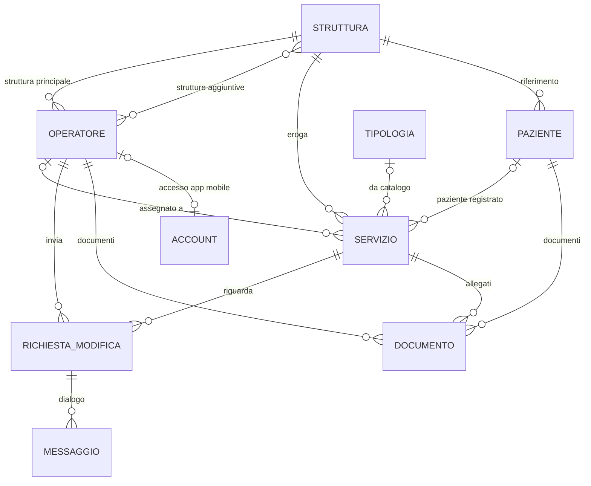

# DATA_MODELS — PeopleCare Central Operations

Modelli di dominio del client desktop della Centrale Operativa: entità, campi,
codici e regole. Il codice di riferimento è in `lib/src/domain` (Dart puro,
senza Flutter); la forma JSON attesa dalle API è in
[API_CONTRACT.md](API_CONTRACT.md) e i codec sono in
`lib/src/data/dto/entity_json.dart`.

> I modelli descrivono ciò che il client **usa e si aspetta**. Non
> documentano un database esistente: il sistema PeopleCare può organizzare i
> propri dati come preferisce, purché le API restituiscano queste forme.

## Indice

1. [Convenzioni](#1-convenzioni)
2. [Relazioni](#2-relazioni)
3. [Operatore](#3-operatore)
4. [Struttura](#4-struttura)
5. [Tipologia di servizio](#5-tipologia-di-servizio)
6. [Paziente](#6-paziente)
7. [Servizio](#7-servizio)
8. [Richiesta di modifica](#8-richiesta-di-modifica)
9. [Documento](#9-documento)
10. [Notifica](#10-notifica)
11. [Voce del registro attività](#11-voce-del-registro-attività)
12. [Report operativo](#12-report-operativo)
13. [Evento operativo e utente della Centrale](#13-evento-operativo-e-utente-della-centrale)
14. [Enumerazioni](#14-enumerazioni)
15. [Regole di dominio](#15-regole-di-dominio)
16. [Tempo, versioni e dati demo](#16-tempo-versioni-e-dati-demo)

## 1. Convenzioni

| Tipo | Significato |
|---|---|
| `string` | Testo UTF-8 |
| `int` / `number` | Intero / numero decimale |
| `bool` | `true` / `false` |
| `timestamp` | Istante RFC 3339 (`2026-09-24T07:30:00Z`); nel client `DateTime` in ora locale |
| `date` | Data di calendario `YYYY-MM-DD` |
| `enum` | Codice testuale, vedi [§14](#14-enumerazioni) |
| `T[]` | Lista |

Colonna **Obbl.**: sì = sempre presente nelle risposte; no = può essere `null`
o assente. Colonna **Origine**: chi scrive il valore (C = Centrale da questa
applicazione, S = sistema, M = app mobile degli operatori).

## 2. Relazioni

I documenti della Centrale (procedure, circolari) non hanno un proprietario
specifico. Notifiche e voci del registro contengono riferimenti facoltativi
alle entità coinvolte.

## 3. Operatore

`Operator` (`lib/src/domain/entities/operator.dart`). Operatore PeopleCare sul
territorio: entità **distinta** da pazienti e clienti.

| Campo Dart | JSON | Tipo | Obbl. | Origine | Descrizione |
|---|---|---|---|---|---|
| `id` | `id` | string | sì | S | ID interno opaco |
| `code` | `code` | string | sì | S | Codice univoco `OP-000184` (6 cifre), assegnato alla creazione |
| `firstName` | `first_name` | string | sì | C | Nome |
| `lastName` | `last_name` | string | sì | C | Cognome |
| `email` | `email` | string | sì | C | Email, univoca tra gli operatori |
| `phone` | `phone` | string | sì | C | Telefono (6–15 cifre, `+` iniziale ammesso) |
| `qualification` | `qualification` | string | sì | C | Qualifica/ruolo (OSS, Infermiere, …) tra quelle del sistema |
| `primaryFacilityId` | `primary_facility_id` | string | sì | C | Struttura principale |
| `secondaryFacilityIds` | `secondary_facility_ids` | string[] | sì (anche vuota) | C | Seconda struttura e successive, senza duplicati né la principale |
| `status` | `status` | enum `OperatorStatus` | sì | C | `attivo`, `sospeso`, `disabilitato` |
| `statusReason` | `status_reason` | string | no | C | Motivo dell'ultima sospensione/disabilitazione |
| `account` | `account` | `OperatorAccount` | no | C/S | Account associato per l'app mobile |
| `lastAccessAt` | `last_access_at` | timestamp | no | S | Ultimo accesso all'app mobile |
| `notes` | `notes` | string | no | C | Note interne |
| `createdAt` / `updatedAt` | `created_at` / `updated_at` | timestamp | sì | S | Creazione / ultima modifica |
| `version` | `version` | int | sì | S | Versione per la concorrenza ottimistica |

Derivati nel client: `fullName`, `sortName` (cognome nome), `initials`,
`facilityIds` (principale + aggiuntive), `belongsTo(struttura)`,
`isAssignable` (= `attivo`), `hasAccount`.

`OperatorAccount` — solo il collegamento, **mai password o token**:

| Campo Dart | JSON | Tipo | Obbl. | Descrizione |
|---|---|---|---|---|
| `accountId` | `account_id` | string | sì | ID dell'account nel sistema di autenticazione |
| `username` | `username` | string | sì | Identificativo di accesso (email aziendale, minuscolo) |
| `status` | `status` | enum `AccountStatus` | sì | `invitato`, `attivo`, `bloccato` |
| `linkedAt` | `linked_at` | timestamp | no | Data del collegamento |

`OperatorDraft` (creazione/modifica): `first_name`, `last_name`, `email`,
`phone`, `qualification`, `primary_facility_id`, `secondary_facility_ids`,
`notes`. Codice, stato e account hanno operazioni dedicate.

## 4. Struttura

`Facility` (`facility.dart`). Sede operativa a cui appartengono operatori,
pazienti e servizi. Il modello supporta un numero qualsiasi di strutture.

| Campo Dart | JSON | Tipo | Obbl. | Descrizione |
|---|---|---|---|---|
| `id` | `id` | string | sì | ID interno |
| `code` | `code` | string | sì | Codice leggibile `STR-01` (assegnato dal sistema) |
| `name` | `name` | string | sì | Nome, univoco |
| `kind` | `kind` | enum `FacilityKind` | sì | Tipo di struttura |
| `address` | `address` | string | sì | Indirizzo |
| `city` | `city` | string | sì | Comune |
| `phone` | `phone` | string | no | Telefono |
| `email` | `email` | string | no | Email |
| `isActive` | `is_active` | bool | no (predefinito `true`) | Se `false` non si può scegliere per nuovi servizi |
| `notes` | `notes` | string | no | Note |
| `version` | `version` | int | sì | Versione |

`FacilityDraft`: tutti i campi modificabili (senza `id`, `code`, `version`).

## 5. Tipologia di servizio

`ServiceType` (`service_type.dart`). Voce del catalogo.

| Campo Dart | JSON | Tipo | Obbl. | Descrizione |
|---|---|---|---|---|
| `id` | `id` | string | sì | ID interno |
| `code` | `code` | string | sì | Codice `TS-04` |
| `name` | `name` | string | sì | Nome, univoco |
| `category` | `category` | string | sì | Area (Assistenza di base, Sanitaria, Riabilitativa, …) |
| `defaultDurationMinutes` | `default_duration_minutes` | int | sì | Durata proposta alla creazione (5–720) |
| `requiredQualifications` | `required_qualifications` | string[] | sì (anche vuota) | Qualifiche adatte; vuota = qualsiasi |
| `description` | `description` | string | no | Descrizione |
| `isActive` | `is_active` | bool | no (predefinito `true`) | Se `false` non si usa per nuovi servizi |
| `version` | `version` | int | sì | Versione |

## 6. Paziente

`Patient` (`patient.dart`). Anagrafica gestita altrove in PeopleCare: la
Centrale la consulta soltanto.

| Campo Dart | JSON | Tipo | Obbl. | Descrizione |
|---|---|---|---|---|
| `id` | `id` | string | sì | ID interno |
| `code` | `code` | string | sì | Codice `PZ-004512` |
| `firstName` / `lastName` | `first_name` / `last_name` | string | sì | Nome e cognome |
| `birthDate` | `birth_date` | date | no | Data di nascita |
| `address` / `city` | `address` / `city` | string | no | Domicilio, proposto come indirizzo del servizio |
| `phone` | `phone` | string | no | Telefono di riferimento |
| `facilityId` | `facility_id` | string | no | Struttura di riferimento |
| `notes` | `notes` | string | no | Indicazioni ricorrenti (citofono, accesso, animali…), proposte come indicazioni del servizio |

## 7. Servizio

`Service` (`service.dart`). Attività da svolgere presso un paziente.

| Campo Dart | JSON | Tipo | Obbl. | Origine | Descrizione |
|---|---|---|---|---|---|
| `id` | `id` | string | sì | S | ID interno |
| `code` | `code` | string | sì | S | Codice `SRV-2026-004812` |
| `kind` | `service_type` **oppure** `custom_type_name` | object / string | uno dei due | C | Tipologia da catalogo (`{id, name}`) o servizio personalizzato (nome libero) |
| `facilityId` | `facility_id` | string | sì | C | Struttura |
| `operatorId` | `operator_id` | string | no | C | Operatore assegnato; `null` = da assegnare |
| `patient` | `patient` | object | sì | C | `{id, first_name, last_name}`; `id: null` = dati inseriti a mano |
| `scheduledStart` / `scheduledEnd` | `scheduled_start` / `scheduled_end` | timestamp | sì | C | Orario pianificato dalla Centrale |
| `actualStart` / `actualEnd` | `actual_start` / `actual_end` | timestamp | no | M | Orari reali registrati dall'app mobile |
| `status` | `status` | enum `ServiceStatus` | sì | S | Stato operativo ([§15](#15-regole-di-dominio)) |
| `priority` | `priority` | enum `ServicePriority` | sì | C | `bassa`, `normale`, `alta`, `urgente` |
| `address` | `address` | string | sì | C | Indirizzo dell'intervento |
| `phone` | `phone` | string | no | C | Telefono di riferimento |
| `directions` | `directions` | string | no | C | Indicazioni per raggiungere/accedere al domicilio |
| `notes` | `notes` | string | no | C | Note per l'operatore |
| `statusReason` | `status_reason` | string | no | C/M | Motivo di annullamento, mancata esecuzione o riprogrammazione |
| `documentCount` | `document_count` | int | no (0) | S | Documenti allegati |
| `openChangeRequestCount` | `open_change_request_count` | int | no (0) | S | Richieste di modifica non chiuse |
| `createdAt` / `createdBy` | `created_at` / `created_by` | timestamp / string | sì | S | Creazione e autore (nome leggibile) |
| `updatedAt` / `updatedBy` | `updated_at` / `updated_by` | timestamp / string | sì | S | Ultima modifica e autore |
| `version` | `version` | int | sì | S | Versione |

Varianti (tipi sigillati Dart):

- `ServiceKind` = `CatalogServiceKind(serviceTypeId, name)` |
  `CustomServiceKind(name)`;
- `ServicePatient` = `RegisteredServicePatient(patientId, firstName,
  lastName)` | `ManualServicePatient(firstName, lastName)`.

Derivati nel client: `isAssigned`, `isCustom`, `serviceTypeId`,
`scheduledRange`, `scheduledDuration`, `actualDuration`, `startDelay`
(`actual_start − scheduled_start`), `occupiedRange(now)` (intervallo in cui
l'operatore è impegnato: orari reali quando presenti; un servizio in corso oltre
la fine programmata occupa fino ad adesso).

`ServiceDraft` (creazione/modifica): `kind`, `scheduledStart`,
`scheduledEnd`, `patient`, `facilityId`, `operatorId`, `priority`,
`address`, `phone`, `directions`, `notes`. In JSON: `service_type_id` /
`custom_type_name`, `patient_id` / `manual_patient`. Gli allegati si
caricano dopo la creazione come documenti del servizio.

## 8. Richiesta di modifica

`ChangeRequest` (`change_request.dart`). Segnalazione dell'operatore su un
servizio assegnato: l'operatore non accetta né rifiuta i servizi.

| Campo Dart | JSON | Tipo | Obbl. | Origine | Descrizione |
|---|---|---|---|---|---|
| `id` | `id` | string | sì | S | ID interno |
| `code` | `code` | string | sì | S | Codice `RM-000321` |
| `serviceId` / `serviceCode` | `service_id` / `service_code` | string | sì | S | Servizio interessato |
| `operatorId` / `operatorName` | `operator_id` / `operator_name` | string | sì | S | Operatore che l'ha inviata |
| `reason` | `reason` | enum `ChangeRequestReason` | sì | M | Motivo |
| `message` | `message` | string | sì | M | Testo libero dell'operatore |
| `proposedStart` / `proposedEnd` | `proposed_start` / `proposed_end` | timestamp | no | M | Orario alternativo proposto |
| `status` | `status` | enum `ChangeRequestStatus` | sì | S | `in_attesa` → `in_lavorazione` (dopo una risposta) → `chiusa` |
| `createdAt` / `updatedAt` | `created_at` / `updated_at` | timestamp | sì | S | Ricezione / ultimo aggiornamento |
| `messages` | `messages` | `ChangeRequestMessage[]` | sì (anche vuota) | C/M | Dialogo successivo, in ordine cronologico |
| `outcome` | `outcome` | enum `ChangeRequestOutcome` | no | C | Esito della chiusura |
| `closedAt` / `closedBy` | `closed_at` / `closed_by` | timestamp / string | no | S | Chiusura |
| `version` | `version` | int | sì | S | Versione |

`ChangeRequestMessage`: `id`, `author_kind` (`ActorKind`), `author_name`,
`text`, `sent_at`.

`ChangeRequestResolution` (decisione della Centrale, con `message`
facoltativo): `RescheduleResolution(start, end)` → `orario_modificato`;
`ReassignResolution(operatorId)` → `riassegnato`;
`KeepAssignmentResolution()` → `assegnazione_mantenuta`. Rispondere senza
chiudere è `reply(message)`.

## 9. Documento

`DocumentInfo` (`document.dart`): metadati; il contenuto si scarica a parte
(`DocumentContent`: `fileName`, `mimeType`, `bytes`).

| Campo Dart | JSON | Tipo | Obbl. | Descrizione |
|---|---|---|---|---|
| `id` | `id` | string | sì | ID interno |
| `title` | `title` | string | sì | Titolo |
| `fileName` | `file_name` | string | sì | Nome del file |
| `mimeType` | `mime_type` | string | sì | Tipo MIME |
| `sizeBytes` | `size_bytes` | int | sì | Dimensione (massimo 20 MB) |
| `category` | `category` | enum `DocumentCategory` | sì | Categoria |
| `owner` | `owner` | object | sì | `{type, id, label}`: proprietario (servizio, operatore, paziente, Centrale); `label` leggibile fornita dal sistema |
| `source` | `source` | enum `DocumentSource` | sì | Chi l'ha prodotto: Centrale, app operatore, sistema |
| `uploadedBy` / `uploadedAt` | `uploaded_by` / `uploaded_at` | string / timestamp | sì | Autore e data di caricamento |
| `description` | `description` | string | no | Descrizione |
| `requiresReview` | `requires_review` | bool | no (`false`) | Documento dal territorio da verificare |
| `reviewedAt` / `reviewedBy` | `reviewed_at` / `reviewed_by` | timestamp / string | no | Verifica della Centrale |

`isPendingReview` = `requires_review` e non ancora verificato.
`DocumentUpload` (caricamento): `owner`, `title`, `fileName`, `mimeType`,
`bytes`, `category`, `description`.

## 10. Notifica

`AppNotification` (`notification.dart`). Notifica per l'utente della
Centrale; lo stato di lettura è per utente.

| Campo Dart | JSON | Tipo | Obbl. | Descrizione |
|---|---|---|---|---|
| `id` | `id` | string | sì | ID |
| `type` | `type` | enum `NotificationType` | sì | Tipo |
| `severity` | `severity` | enum `NotificationSeverity` | sì | `info`, `attenzione`, `critica` |
| `title` / `message` | `title` / `message` | string | sì | Testi già leggibili |
| `createdAt` | `created_at` | timestamp | sì | Creazione |
| `readAt` | `read_at` | timestamp | no | Lettura da parte dell'utente |
| `serviceId`, `operatorId`, `changeRequestId`, `documentId` | `service_id`, `operator_id`, `change_request_id`, `document_id` | string | no | Collegamenti alle entità coinvolte |

## 11. Voce del registro attività

`AuditEntry` (`audit_entry.dart`). Scritta solo dal sistema, in sola aggiunta.

| Campo Dart | JSON | Tipo | Obbl. | Descrizione |
|---|---|---|---|---|
| `id` | `id` | string | sì | ID |
| `occurredAt` | `occurred_at` | timestamp | sì | Momento dell'operazione |
| `actorKind` / `actorName` / `actorId` | `actor.kind` / `actor.name` / `actor.id` | enum / string / string | sì / sì / no | Chi l'ha eseguita (Centrale, operatore, sistema) |
| `action` | `action` | string | sì | Codice azione (`servizio.riprogrammato`, …; elenco in API_CONTRACT §13) |
| `entityType` / `entityId` / `entityLabel` | `entity.type` / `entity.id` / `entity.label` | enum / string / string | sì | Elemento interessato |
| `summary` | `summary` | string | sì | Descrizione leggibile |
| `changes` | `changes` | `FieldChange[]` | sì (anche vuota) | `{field, label, old_value, new_value}` con valori leggibili |
| `serviceId` | `service_id` | string | no | Servizio collegato (cronologia del servizio) |

## 12. Report operativo

`OperationalReport` (`report.dart`), richiesto con `ReportQuery(period,
facilityId?)`. Campi: `period`, `facility_id`, `generated_at`,
`total_services`, `by_status`, `started_services`, `on_time_starts`,
`on_time_tolerance_minutes`, `average_start_delay_minutes`,
`scheduled_minutes`, `delivered_minutes`, `change_request_count`,
`change_requests_by_reason`, `daily[]` (`DailyServiceStat`: giorno e conteggi
per stato), `operators[]` (`OperatorReportRow`), `service_types[]`
(`ServiceTypeReportRow`), `facilities[]` (`FacilityReportRow`). Definizioni
in API_CONTRACT §14. Derivati: `completionRate` = completati / (completati +
non eseguiti); `punctualityRate` = avvii puntuali / avvii.

## 13. Evento operativo e utente della Centrale

`OperationalEvent` (`operational_event.dart`): `topic`
(`OperationalEventTopic`), `entity_id` facoltativo, `occurred_at`. Non
trasporta dati: segnala che un argomento è cambiato e le schermate rileggono.

`CentralUser` (`central_user.dart`): `id`, `display_name`, `role` (descrittivo,
es. "Operatrice di centrale"), `facility_ids` (strutture di competenza, vuota
= tutte).

## 14. Enumerazioni

Colonna **Se sconosciuto**: comportamento del client per un codice non
previsto. "Errore" = la risposta è considerata non valida
(`FormatException`).

### Stato del servizio — `ServiceStatus`

| Codice | Etichetta | Significato | Se sconosciuto |
|---|---|---|---|
| `da_assegnare` | Da assegnare | Creato senza operatore | Errore |
| `assegnato` | Assegnato | Operatore assegnato, non ancora iniziato | |
| `in_corso` | In corso | Avviato dall'app mobile (`actual_start`) | |
| `completato` | Completato | Terminato dall'app mobile (`actual_end`) | |
| `annullato` | Annullato | Annullato dalla Centrale | |
| `non_eseguito` | Non eseguito | Non svolto (paziente assente, rifiuto, impedimento) | |
| `da_riprogrammare` | Da riprogrammare | L'orario non è più valido: serve un nuovo orario | |

Stati finali: `completato`, `annullato`, `non_eseguito`. Impegnano
l'operatore (contano per le sovrapposizioni): `assegnato`, `in_corso`,
`completato`. Richiedono intervento: `da_assegnare`, `da_riprogrammare`.

### Altre enumerazioni

| Enumerazione | Codici (etichetta) | Se sconosciuto |
|---|---|---|
| `ServicePriority` | `bassa` (Bassa), `normale` (Normale), `alta` (Alta), `urgente` (Urgente) | Errore |
| `OperatorStatus` | `attivo` (Attivo), `sospeso` (Sospeso), `disabilitato` (Disabilitato) | Errore |
| `AccountStatus` | `invitato` (Invito inviato), `attivo` (Attivo), `bloccato` (Bloccato) | Errore |
| `FacilityKind` | `rsa` (RSA), `centro_diurno` (Centro diurno), `servizio_domiciliare` (Servizio domiciliare), `comunita_alloggio` (Comunità alloggio), `ambulatorio` (Ambulatorio), `altro` (Altro) | `altro` |
| `ChangeRequestReason` | `problema_orario` (Problema di orario), `sovrapposizione` (Sovrapposizione), `indisponibilita` (Indisponibilità), `problema_logistico` (Problema logistico), `imprevisto` (Imprevisto), `altro` (Altro) | `altro` |
| `ChangeRequestStatus` | `in_attesa` (In attesa), `in_lavorazione` (In lavorazione), `chiusa` (Chiusa) | Errore |
| `ChangeRequestOutcome` | `orario_modificato` (Orario modificato), `riassegnato` (Riassegnato), `assegnazione_mantenuta` (Assegnazione mantenuta) | Errore |
| `ActorKind` | `centrale` (Centrale), `operatore` (Operatore), `sistema` (Sistema) | `sistema` |
| `DocumentOwnerType` | `servizio`, `operatore`, `paziente`, `centrale` | Errore |
| `DocumentCategory` | `piano_assistenziale`, `consenso`, `referto`, `verbale`, `foglio_firma`, `certificato`, `documento_identita`, `procedura`, `fotografia`, `altro` | `altro` |
| `DocumentSource` | `centrale` (Centrale), `operatore` (App operatore), `sistema` (Sistema) | `sistema` |
| `NotificationType` | `richiesta_modifica`, `servizio_iniziato`, `servizio_terminato`, `documento_ricevuto`, `servizio_problematico`, `operativa` | `operativa` |
| `NotificationSeverity` | `info` (Informativa), `attenzione` (Attenzione), `critica` (Critica) | `info` |
| `AuditEntityType` | `servizio`, `operatore`, `struttura`, `tipologia_servizio`, `richiesta_modifica`, `documento`, `sessione` | `sessione` |
| `OperationalEventTopic` | `servizi`, `operatori`, `strutture`, `tipologie_servizio`, `richieste_modifica`, `documenti`, `notifiche`, `registro_attivita` | Evento ignorato |

## 15. Regole di dominio

Regole pure in `lib/src/domain/logic`, usate dall'interfaccia per abilitare i
comandi e spiegare perché un'azione non è possibile. **Il sistema PeopleCare
resta l'autorità finale** e deve applicare le stesse regole (API_CONTRACT §9).

### `ServicePolicy` — cosa si può fare su un servizio

| Azione | Stati ammessi |
|---|---|
| Modifica completa, riprogrammazione, riassegnazione, annullamento | `da_assegnare`, `assegnato`, `da_riprogrammare` |
| Segna da riprogrammare | `da_assegnare`, `assegnato` |
| Allegare documenti | Qualsiasi stato |
| Eliminazione | Mai avviato, `da_assegnare` o `annullato`, senza documenti e senza richieste di modifica aperte |

Orario valido: fine successiva all'inizio, durata massima 12 ore. Stato dopo
una riprogrammazione: `assegnato` se c'è un operatore, altrimenti
`da_assegnare`. Dopo una riassegnazione un servizio `da_riprogrammare` resta
tale finché non riceve un nuovo orario.

### `ScheduleConflictDetector` — sovrapposizioni

Due servizi dello stesso operatore si sovrappongono se i loro intervalli di
impegno (`occupiedRange`) si intersecano per più di zero minuti. Contano solo
gli stati che impegnano l'operatore. Le sovrapposizioni non sono vietate: sono
evidenziate nel calendario, nella dashboard e durante assegnazione e
riprogrammazione.

### `ServiceAlertEvaluator` — anomalie operative

| Anomalia | Condizione | Gravità |
|---|---|---|
| Avvio in ritardo | `assegnato`, senza `actual_start`, oltre 10 min dall'inizio | critica oltre 30 min |
| Sforamento | `in_corso` oltre 15 min dalla fine programmata | attenzione |
| Da assegnare a breve | `da_assegnare` che inizia entro 24 ore (o già iniziato) | critica entro 2 ore |
| Da riprogrammare | stato `da_riprogrammare` | attenzione |
| Non eseguito | stato `non_eseguito` | attenzione |
| Operatore non attivo | servizio non concluso assegnato a un operatore sospeso o disabilitato | critica |
| Richiesta aperta | servizio non concluso con richieste di modifica aperte | attenzione |
| Sovrapposizione | due servizi dello stesso operatore in conflitto (non entrambi completati) | critica |

### `AssignmentAdvisor` — suggerimento dell'operatore

Ordina i candidati per: disponibile (attivo) → libero nella fascia →
appartenente alla struttura (principale o aggiuntiva) → qualifica adatta alla
tipologia → minor carico programmato nella giornata → cognome. Non decide al
posto della Centrale: mostra i motivi di ogni avvertenza. Gli operatori
disabilitati non sono mai proposti.

### `ReportCalculator`

Calcolo di riferimento del report operativo (definizioni in API_CONTRACT §14).

## 16. Tempo, versioni e dati demo

- **Tempo.** Tutta la logica che dipende da "adesso" riceve un `Clock`
  (`lib/src/core/clock.dart`), sostituibile nei test. Gli intervalli
  (`DateRange`) sono semiaperti `[inizio, fine)`; giorni e settimane
  (lunedì–domenica) si calcolano in ora locale senza errori al cambio dell'ora
  legale.
- **Versioni.** Ogni modifica invia la `version` letta; un conflitto produce
  `ConcurrencyConflictException` e l'interfaccia invita a ricaricare.
- **Errori.** I repository traducono ogni errore tecnico nelle eccezioni di
  `lib/src/core/errors.dart` (`NotFoundException`,
  `ConcurrencyConflictException`, `ValidationException` con `fieldErrors`,
  `OperationNotAllowedException`, `PermissionDeniedException`,
  `UnauthenticatedException`, `ConnectivityException`,
  `UnexpectedRepositoryException`), con messaggi in italiano.
- **Dati demo.** `lib/src/data/mock` genera in memoria, attorno alla data
  corrente e con seme fisso, tre settimane di storico e due di
  pianificazione: 5 strutture, 13 tipologie, 26 operatori (7 su più
  strutture, uno sospeso e uno disabilitato), 48 pazienti, circa 3.400
  servizi in tutti gli stati, richieste di modifica, documenti, notifiche e
  registro attività. Nomi e contatti sono inventati;
  le email usano il dominio riservato `.example` e i telefoni un blocco
  `000`. Un simulatore riproduce gli eventi dell'app mobile (avvii, chiusure,
  nuove richieste e documenti). Nessun dato demo è usato fuori da questa
  cartella.
