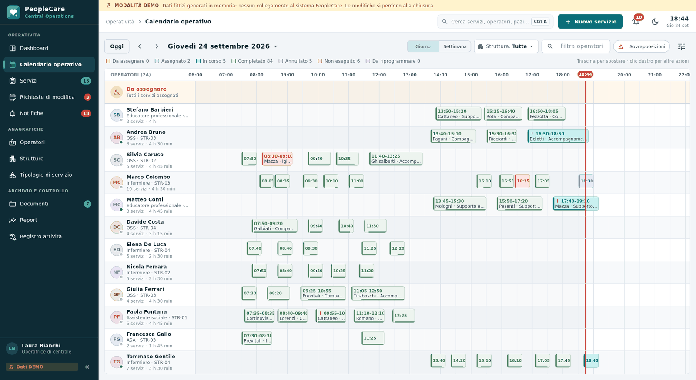
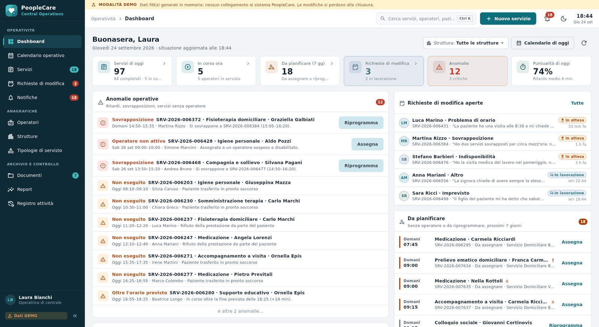
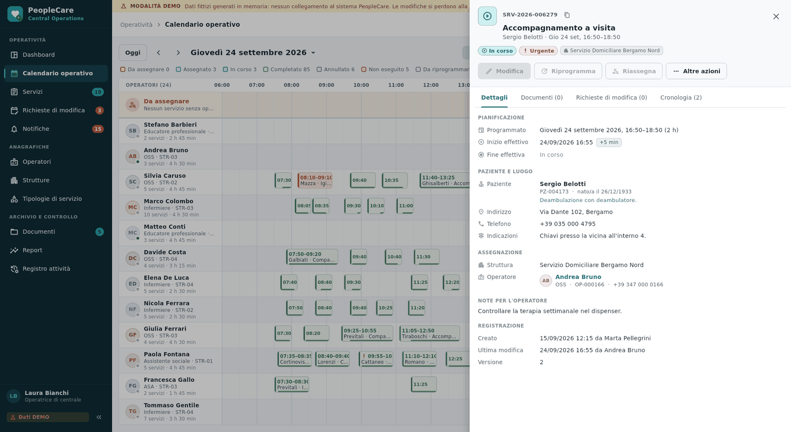
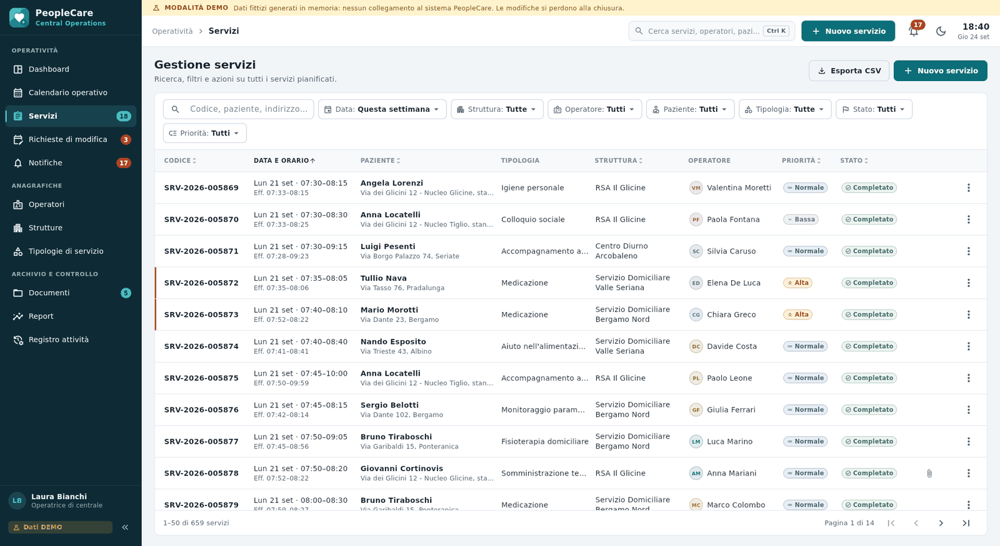
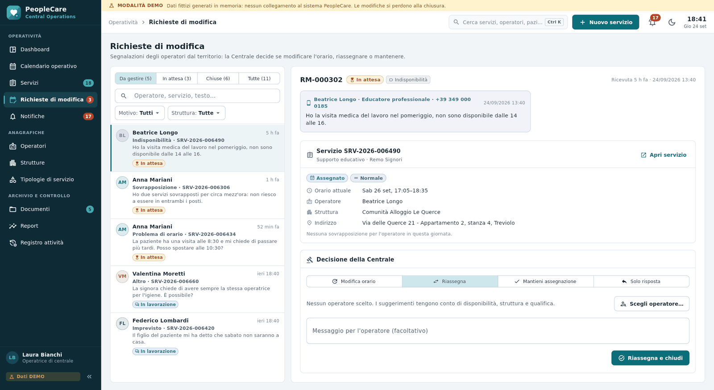
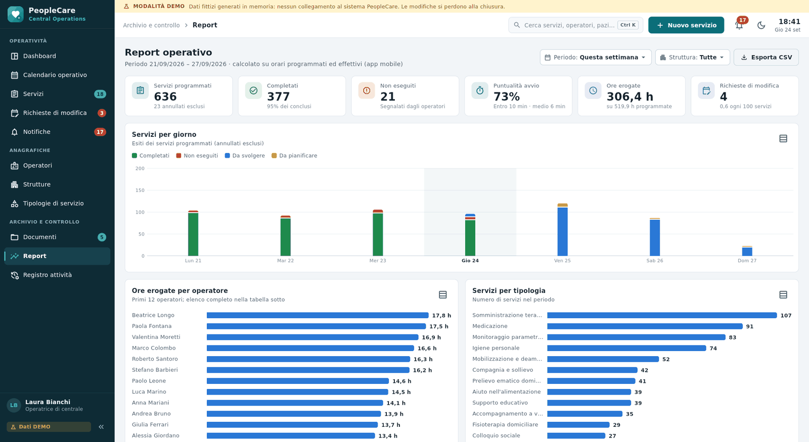

# PeopleCare Central Operations

Pannello operativo desktop per Windows della **Centrale Operativa
PeopleCare**: pianificazione e controllo quotidiano dei servizi sociosanitari
svolti dagli operatori sul territorio.

È un'applicazione **Flutter Desktop nativa** (non una WebView, non un CMS),
pensata per l'uso continuativo da parte degli operatori di centrale su schermi
Windows 1080p e superiori.

> **Stato: dati DEMO.** L'applicazione funziona oggi con dati fittizi generati
> in memoria, chiaramente segnalati nell'interfaccia. Il collegamento al
> sistema PeopleCare avverrà sostituendo i repository demo con
> un'implementazione HTTP del contratto descritto in
> [API_CONTRACT.md](API_CONTRACT.md) (atteso, non esistente): vedi
> [HANDOFF.md](HANDOFF.md). Nel progetto non ci sono backend, database,
> endpoint reali, token o credenziali.



## Indice

- [Funzionalità](#funzionalità)
- [Schermate](#schermate)
- [Requisiti](#requisiti)
- [Avvio rapido](#avvio-rapido)
- [Build e pacchetto per Windows](#build-e-pacchetto-per-windows)
- [Configurazione](#configurazione)
- [Architettura](#architettura)
- [Struttura del progetto](#struttura-del-progetto)
- [Qualità: analisi, test, CI](#qualità-analisi-test-ci)
- [Scorciatoie da tastiera](#scorciatoie-da-tastiera)
- [Documentazione](#documentazione)
- [Perimetro](#perimetro)

## Funzionalità

| Sezione | Cosa permette |
|---|---|
| **Dashboard** | Situazione del giorno: servizi di oggi, in corso, da pianificare, richieste di modifica, anomalie, puntualità. Elenco delle anomalie operative (ritardi di avvio, sforamenti, sovrapposizioni, servizi senza operatore in partenza, operatori non attivi) con l'azione risolutiva a portata di clic. |
| **Calendario operativo** | Vista giorno per operatore (con riga "Da assegnare") e vista settimana. Orari programmati ed effettivi, ora attuale, sovrapposizioni evidenziate, filtri per struttura e operatore. Trascinamento per spostare o riassegnare, menu contestuale con tutte le azioni. |
| **Servizi** | Gestione separata in tabella: ricerca e filtri per struttura, operatore, paziente, tipologia, data, stato, priorità; ordinamento, paginazione, esportazione CSV. |
| **Dettaglio servizio** | Pianificazione, orari reali (`scheduled_*` / `actual_*`), paziente e luogo, assegnazione, documenti, richieste di modifica e cronologia completa delle modifiche. Azioni: modifica, riprogrammazione, riassegnazione, annullamento, "da riprogrammare", eliminazione quando consentita. |
| **Nuovo servizio** | Tipologia da catalogo o personalizzata, data e orari, paziente registrato o dati manuali, struttura, operatore (con suggerimenti per disponibilità, struttura e qualifica e avviso di sovrapposizione), priorità, indirizzo, telefono, indicazioni, note, allegati. |
| **Richieste di modifica** | Segnalazioni degli operatori (problema di orario, sovrapposizione, indisponibilità, problema logistico, imprevisto, altro, testo libero). La Centrale modifica l'orario, riassegna, mantiene l'assegnazione o risponde. L'operatore non accetta né rifiuta i servizi. |
| **Notifiche** | Nuove richieste, servizi iniziati e terminati, documenti ricevuti, servizi problematici, comunicazioni operative; avvisi a comparsa e contatore. |
| **Operatori** | Anagrafica dell'Operatore PeopleCare (entità distinta dai pazienti): codice `OP-000184`, dati di contatto, qualifica, struttura principale e strutture aggiuntive, stato attivo/sospeso/disabilitato, account associato, ultimo accesso, carico di lavoro. |
| **Strutture** | Sedi operative (il modello supporta già due o più strutture per operatore), con operatori e servizi del giorno. |
| **Tipologie di servizio** | Catalogo con durata predefinita e qualifiche richieste. |
| **Documenti** | Archivio per servizio, operatore, paziente e Centrale; caricamento, download, verifica dei documenti arrivati dal territorio. |
| **Report** | Servizi per giorno ed esito, puntualità di avvio, ore erogate per operatore, tipologia e struttura; vista tabellare ed esportazione CSV. |
| **Registro attività** | Tracciabilità di ogni operazione di Centrale, operatori e sistema, con i campi modificati; esportazione CSV. |

Inoltre: ricerca rapida globale (Ctrl+K), aggiornamento automatico delle
schermate sugli eventi in tempo reale, tema chiaro e scuro, interfaccia e
formati interamente in italiano.

## Schermate

Acquisite dalla build di verifica, con dati DEMO.

| | |
|---|---|
|  |  |
| Dashboard | Dettaglio del servizio |
|  |  |
| Gestione servizi | Richieste di modifica |
|  |  |
| Report operativo | Calendario operativo |

## Requisiti

- Windows 10 o 11, 64 bit.
- [Flutter](https://docs.flutter.dev/get-started/install/windows/desktop)
  3.47.5, canale stable (Dart 3.13), con il supporto desktop Windows attivo.
- Visual Studio 2022 con il carico di lavoro **"Sviluppo di applicazioni
  desktop con C++"** (richiesto da Flutter per la build Windows).

Verifica dell'ambiente: `flutter doctor` deve indicare "Windows Version" e
"Visual Studio" senza errori.

## Avvio rapido

```powershell
cd peoplecare-central-operations
flutter pub get
flutter run -d windows
```

oppure `.\scripts\run_windows_dev.ps1` (opzioni `-LatencyMs 0` per togliere
il ritardo simulato, `-NoSimulation` per fermare gli eventi simulati
dell'app mobile, `-Release`).

All'avvio compare la barra gialla **MODALITÀ DEMO**: tutti i dati sono
generati in memoria attorno alla data odierna e si perdono alla chiusura.

## Build e pacchetto per Windows

```powershell
.\scripts\build_windows.ps1
```

Esegue `flutter pub get`, `flutter analyze`, `flutter test`,
`flutter build windows --release` e crea lo ZIP in `dist\`
(`PeopleCareCentralOperations-<versione>-windows-x64-mock.zip`). Parametri
utili: `-SkipChecks`, `-NoZip`, `-BuildName 1.0.1`, `-BuildNumber 42`,
`-DataSource api -ApiBaseUrl https://…` (solo quando i repository HTTP
saranno realizzati). Da Prompt dei comandi: `scripts\build_windows.bat` con
gli stessi parametri.

L'eseguibile è `build\windows\x64\runner\Release\PeopleCareCentralOperations.exe`:
va distribuita l'intera cartella `Release`. La finestra si apre centrata a
1600×940 (massimizzata sugli schermi più piccoli), con dimensione minima
1280×720, titolo "PeopleCare Central Operations", icona e informazioni di
versione dedicate.

Altri script:

| Script | Uso |
|---|---|
| `scripts/check.sh`, `scripts\check.ps1` | Formattazione, analisi statica e test (come la CI) |
| `scripts/package_zip.sh`, `scripts\package_zip.ps1` | ZIP del codice sorgente, senza build e cache |
| `scripts/generate_app_icon.py` | Rigenera l'icona Windows (richiede Pillow) |

## Configurazione

Valori letti in fase di build con `--dart-define` (`lib/src/app/app_config.dart`).
Non contengono e non devono contenere credenziali.

| Chiave | Valori | Predefinito | Significato |
|---|---|---|---|
| `PEOPLECARE_DATA_SOURCE` | `mock`, `api` | `mock` | Origine dei dati. `api` oggi mostra un messaggio che rimanda a HANDOFF.md |
| `PEOPLECARE_API_BASE_URL` | URL | — | Indirizzo base delle API PeopleCare (solo con `api`) |
| `PEOPLECARE_DEMO_LATENCY_MS` | intero | `180` | Ritardo simulato delle chiamate demo |
| `PEOPLECARE_DEMO_SIMULATION` | `true`, `false` | `true` | Eventi simulati dall'app mobile (avvii, chiusure, richieste, documenti) |

## Architettura

Clean architecture a livelli, con dipendenze in un'unica direzione:

```text
presentation ──▶ domain ◀── data (mock | dto)
      │             ▲
      └──▶ core ◀───┘          app (composition root) conosce tutti i livelli
```

- **domain** — entità (Operatore, Struttura, Servizio, Richiesta di modifica,
  Documento, …), filtri, **repository astratti** e regole pure (stati del
  servizio, sovrapposizioni, anomalie, suggerimento dell'operatore, report).
  Dart puro, senza Flutter.
- **data/mock** — implementazione DEMO in memoria dei repository, con dati
  realistici e un simulatore dell'app mobile. Sostituibile senza toccare
  l'interfaccia.
- **data/dto** — codec JSON, corpi delle richieste, parametri di ricerca,
  mappatura degli errori e decoder degli eventi secondo API_CONTRACT.md,
  pronti per l'implementazione HTTP.
- **presentation** — tema, stato condiviso, widget e schermate. Legge e
  scrive **solo** tramite i repository astratti ricevuti dal composition root
  (`AppScope`); nessun widget conosce il mock.
- **app** — configurazione e composition root (`bootstrap.dart`): l'unico
  punto che sceglie l'implementazione dei repository.

Scelte principali: concorrenza ottimistica con `version`/`expected_version`,
errori tipizzati con messaggi in italiano, eventi in tempo reale che fanno
ricaricare solo le schermate interessate, orologio iniettabile (`Clock`) per
test e simulazioni.

Le regole di dipendenza sono verificate da `test/architecture_test.dart`.

## Struttura del progetto

```text
peoplecare-central-operations/
├── lib/
│   ├── main.dart
│   └── src/
│       ├── core/            orologio, errori, paginazione, date, testo
│       ├── domain/          entità, filtri, repository astratti, regole
│       ├── data/
│       │   ├── mock/        SOLO DEMO: backend in memoria, dati, simulatore
│       │   └── dto/         JSON e protocollo secondo API_CONTRACT.md
│       ├── platform/        finestre di dialogo dei file (Windows)
│       ├── presentation/
│       │   ├── theme/       colori, tipografia, stili di stato
│       │   ├── app_state/   navigazione, dati di riferimento, notifiche, contatori
│       │   ├── shared/      formattazione, CSV, widget condivisi
│       │   ├── shell/       barra laterale, barra superiore, ricerca, avvisi
│       │   └── features/    una cartella per sezione
│       └── app/             configurazione e composition root
├── test/                    dominio, dati, contratto API, interfaccia, architettura
├── windows/                 runner nativo Windows
├── scripts/                 build, verifica, pacchetti, icona
├── docs/screenshots/
├── API_CONTRACT.md
├── DATA_MODELS.md
└── HANDOFF.md
```

## Qualità: analisi, test, CI

```bash
flutter analyze        # nessun problema segnalato
flutter test           # suite completa
scripts/check.sh       # formattazione + analisi + test
```

La suite copre regole di dominio, repository demo e dati generati,
simulatore, codec JSON e **contratto API** (gli esempi di API_CONTRACT.md sono
confrontati con i codec), avvio completo dell'app con navigazione in tutte le
sezioni, scorciatoie, form del nuovo servizio, regole di architettura e
assenza di credenziali nel codice.

La pipeline GitHub Actions `.github/workflows/peoplecare-central-operations.yml`
esegue i controlli su Linux e la build release su Windows, pubblicando lo ZIP
tra gli artefatti dell'esecuzione.

## Scorciatoie da tastiera

| Tasti | Azione |
|---|---|
| Ctrl+K | Ricerca rapida di servizi, operatori e pazienti |
| Ctrl+N | Nuovo servizio |
| Ctrl+1 … Ctrl+9 | Dashboard, Calendario, Servizi, Richieste di modifica, Notifiche, Operatori, Strutture, Tipologie, Documenti |
| Clic destro su un servizio del calendario | Menu delle azioni |
| Trascinamento nel calendario | Sposta nell'orario o riassegna a un altro operatore |

## Documentazione

| Documento | Contenuto |
|---|---|
| [API_CONTRACT.md](API_CONTRACT.md) | API che il client si aspetta dal sistema PeopleCare (attese, non esistenti), con esempi verificati dai test |
| [DATA_MODELS.md](DATA_MODELS.md) | Entità, campi, codici, stati e regole di dominio |
| [HANDOFF.md](HANDOFF.md) | Cosa collegare e come: repository HTTP, eventi, autenticazione, test, distribuzione |

## Perimetro

Incluso: il client desktop Windows della Centrale Operativa.

Escluso per scelta: backend e database, app mobile degli operatori,
autenticazione, PeopleCareTV (non modificato), Patient Safety (non creato).
